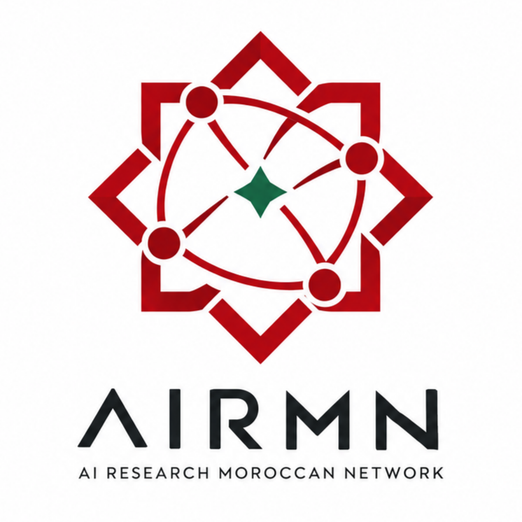

# AIRMN branding

`airmn-logo.png` is the image currently used as the AIRMN Discord server icon. It is a light-background raster image, not an editable master or an approved transparent or dark-mode variant. Layout colors and additional logo versions are still being reviewed; do not infer exact palette values from this image. The logo is not covered by the repository's MIT License. See [`NOTICE`](../NOTICE).

See the [visual identity guide](visual-identity.md) for proposed colors, typography, and application rules. The guide is public so contributors can use it, but its proposed specifications are not approved final assets.

## Logo meaning

The AIRMN logo represents a distributed research community becoming stronger through connection.

The four outer dots symbolize researchers, laboratories, universities, and communities located across different places. They are deliberately separated spatially, reflecting the international nature of the Moroccan research diaspora and the fact that important contributors to Moroccan AI may be working in many different countries and institutions.

The lines connecting those nodes represent collaboration, knowledge exchange, mentorship, scientific discussion, and joint research. They emphasize that the value of a research network does not come simply from having talented individuals, but from the relationships through which ideas, opportunities, and expertise circulate.

The inward connections lead toward the green center, which represents the singularity of collective intelligence: the point at which many independent researchers, perspectives, and capabilities converge into something greater than any individual contribution. It represents shared scientific purpose, intellectual concentration, and the possibility of creating new knowledge through collaboration.

The green center also provides a subtle reference to Morocco, while the surrounding deep red geometric structure draws inspiration from Moroccan visual identity and geometric tradition without reproducing the national flag literally.

The outer geometric form represents Morocco as the common intellectual home of the network, while its open, interconnected construction communicates that the organization is not inward-looking. AIRMN is intended to connect Morocco with the wider international scientific community.

The white paths between the four nodes emphasize international connectivity: researchers communicating across borders, institutions, and disciplines. The green paths moving toward the center represent those collaborations contributing knowledge back into a shared research ecosystem.

Together, the symbol expresses the central philosophy of AIRMN:

Distributed globally. Connected intellectually. Advancing together.

It represents researchers around the world remaining connected through science, transforming individual knowledge into collective intelligence, and helping strengthen Morocco's presence in global AI research.

## Using the logo

- Use the image as provided. Do not recolor, crop, stretch, rotate, or redraw it.
- Keep enough clear space around the mark for it to remain readable.
- Do not use the logo to suggest sponsorship, partnership, or endorsement without permission from the AIRMN organizers.
- For press, events, or derivative brand assets, contact the AIRMN team through the community channels.
